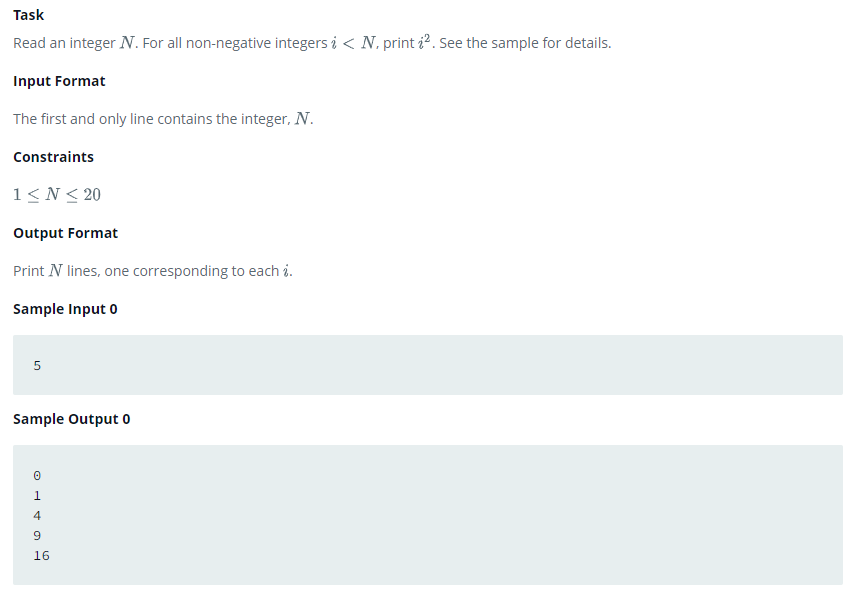

# Loops

## Problem Statement

## Solution

[Open in Browser (raw)](https://raw.githubusercontent.com/iUtsavB/HackerRankSolutions/master/Practice/Python/Introduction/Loops/Loops.py)

[Download .py file](Loops.py)

## Test case Result

1 out of 1 passed after running the code.

2 out of 2 passed after submitting the code.
